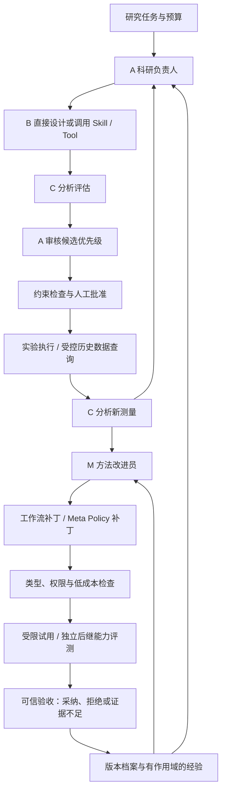

# ProteinRSI

**实验反馈驱动的蛋白研究多 Agent 框架：内环优化研究对象，外环验证并改进科研方法，再对改进器本身进行独立验收。**

[English](README.en.md) · [架构](docs/ARCHITECTURE.md) · [接入工具](docs/INTEGRATIONS.md) · [评测](docs/EVALUATION.md) · [许可与复用](THIRD_PARTY.md)

> **v0.1.0 是可运行的研究实现，不是已验证的蛋白设计产品。** 默认 demo 使用本仓库生成的人工数值和确定性角色，不调用真实 LLM、不运行蛋白模型、不产生湿实验结果。真实 LLM、MCP、LangGraph 和 GEPA 通过可选适配器接入；模型、数据、许可证和实验执行条件需另行提供。

## 系统里有什么？

| 角色 | 职责 | 代码 |
|---|---|---|
| A 科研负责人 | 制定计划，审核 C 的排序，确定候选优先级 | `agents.PrincipalAgent` |
| B 蛋白设计员 | 直接输出序列／突变编辑，或调用允许的工具 | `agents.DesignerAgent` |
| C 分析评估员 | 计算排序、分析新反馈，区分预测与实测 | `agents.AnalystAgent` |
| M 方法改进员 | 提出工作流补丁或自身 meta-policy 后继版本 | `agents.MetaAgent` |

四个逻辑角色可以使用同一个模型。工具、实验后端、预算账本和验收程序不是额外的 Agent。



**三个版本分别记录**：`evidence_version` 是已揭示证据，`workflow_version` 是 A/B/C 的方法，`meta_version` 是 M 的改进方法。更换候选或重拟合相同预测器不等于 RSI。

## 五分钟运行

要求 Python 3.11+，Linux/macOS；Windows 使用 WSL。首次安装需要访问包仓库，安装后默认演示不联网。

```bash
git clone https://github.com/zzjw0611/ProteinRSI.git
cd ProteinRSI
python -m venv .venv
source .venv/bin/activate
pip install -e '.[dev]'

proteinrsi demo --out runs/demo --rounds 5 --seed 17
proteinrsi status --campaign runs/demo/campaign
pytest -q
```

Demo 生成 `runs/demo/fixture/`、SQLite 状态、每轮批次、反馈、工作流试用结果和 `report.json`。重复使用相同 demo 目录会报错，避免覆盖旧实验。某个补丁可能被接受、拒绝或判为证据不足；代码不会强制出现“进步”。

查看结构化审计轨迹：

```python
from proteinrsi.storage import Store
store = Store('runs/demo/campaign')
for event in store.events():
    print(event['kind'], event['payload'])
```

## 实际实现状态

| 能力 | v0.1 状态与边界 |
|---|---|
| 多轮候选—反馈循环 | 已实现；任务级 SQLite 持久化、断点恢复、批次审批与幂等导入 |
| 直接序列／突变设计 | 已实现真实 HTTP LLM 路径；本地测试使用模拟传输，不提供模型密钥 |
| 工具调用 | 已实现 Schema、白名单、目标保护、预算、结果缓存和 MCP v1 HTTP 适配；需配置实际服务与输出映射 |
| 工作流改进 | 已实现补丁暂存、等名额双臂实验、独立验收、版本更新和经验记录 |
| 受限 RSI | M 可提出自身策略／提示的后继，独立比较后继工作流质量，验收后加载新 M |
| 任意 Python 自修改 | **未开放**；不在宿主机执行 LLM 生成代码。当前演化范围是有类型的策略和提示配置 |
| 单／多位点任务 | 已实现有限候选库设计、直接编辑和基于已测数据的排序 |
| Binder | 有固定长度 scaffold／固定靶点约束与外部工具入口；**不是开箱即用的从头设计平台** |
| 亲和力 | 固定输入、预测产物和反馈接口；**没有内置可靠亲和力模型**，不能用 Ridge/结构分数冒充 Kd |
| 湿实验 | 已实现人工批准、批次导出、真实结果导入；没有机器人驱动，也没有本项目产生的新湿实验数据 |
| 跨蛋白经验 | 已记录作用域与未验证迁移状态；迁移收益必须通过新的实验协议验证 |

原生控制器无需 LangGraph 即可运行，是断网／轻量环境的可测试入口。安装 `graph` extra 后，**同一套操作**由真实 LangGraph 状态图编排，而不是另造一套实验逻辑。

## 使用已有实测数据模拟多轮实验

不随仓库分发 SSMuLA、ProteinGym 或其他第三方数据。先确认原始数据许可并准备 CSV。最小格式为：

```csv
sequence,value,qc
ACDE,1.0,valid
AFDE,1.3,valid
```

必须提供正确的母本和 1-based 序列位点；结构文件残基号不能直接当序列位置。

```bash
python scripts/prepare_replay.py \
  --csv /path/to/your_data.csv \
  --sequence-column full_sequence --value-column fitness \
  --reference ACDE --positions 2 --out runs/replay-input

proteinrsi init --task runs/replay-input/task.json --out runs/replay
proteinrsi replay --campaign runs/replay --dataset runs/replay-input/measurements.csv
```

脚本也支持 `--site-sequences`：输入列只保存可变位点的氨基酸串时，根据显式位点重建完整序列。重复记录不擅自聚合，缺失值不自动填零，库外候选不编造标签。没有母本测量时需显式使用 `--controls 0`。

大候选库每轮按公开序列、随机种子和已测集合提取至多 `proposal_pool_size` 个候选；该步骤不读取未知标签。它是有限池搜索，不等于对完整景观进行无限规模推断。

**按轮查询已有实测值是历史实测回放，不是新湿实验。** `feedback_source` 始终记录这一差别。

## 接入 LLM 与蛋白工具

默认无模型、无密钥、无隐式云服务。开启真实 LLM：

```bash
export PROTEINRSI_MODEL='your-model-id'
export PROTEINRSI_BASE_URL='https://your-provider/v1'
export PROTEINRSI_API_KEY='set-locally'

proteinrsi step --campaign runs/replay --agent llm
```

`.env.example` 只是模板；程序不自动加载 `.env`。HTTP 接口需要支持 Chat Completions 风格 JSON 输出，实际响应仍独立验证。模型出错时明确失败，不自动切回确定性假 Agent。

```bash
pip install -e '.[graph,mcp,gepa]'
proteinrsi step --campaign runs/replay --agent llm --tools /path/to/bindings.json
```

工具绑定由操作者提供，并固定工具版本、输入 Schema 哈希、输出 Schema、任务适用范围和受保护输入。跨主机传输还需 `--allow-data-egress`。**安装 MCP SDK 不会自动安装 ESM、Protenix、Rosetta 或 ProteinMPNN。** 详见 [INTEGRATIONS](docs/INTEGRATIONS.md)。

## 真实湿实验：计划、批准、等待、导入

修改 `examples/wetlab_task.json`，填写自己的母本、允许位点、实验目标、单位、已批准 assay 版本和预算。

```bash
proteinrsi init --task examples/wetlab_task.json --out runs/wet
proteinrsi step --campaign runs/wet --agent llm
# 输出 pending_batch；在运行目录查看批次和 results.template.csv
proteinrsi approve --campaign runs/wet --batch YOUR_BATCH_ID --operator YOUR_NAME

# 在实验室执行；填写真实测量，保留 sample_id、序列哈希、单位与 assay 版本。
proteinrsi import-results --campaign runs/wet --file /path/to/results.csv --agent llm
proteinrsi step --campaign runs/wet --agent llm
```

未批准批次不能导入；模板空白行不算测量；一个批次必须提供每个样本的最终状态（`valid`、`failed` 或 `inconclusive`）。可在导入前逐步收集结果，但 v0.1 不支持部分批次自动推进。重复导入完全相同数据是幂等操作，冲突数据会被拒绝。

取消尚未批准的批次：

```bash
proteinrsi cancel --campaign runs/wet --batch YOUR_BATCH_ID --operator YOUR_NAME
```

批准后实验名额按已提交计费，不能通过回滚工作流退款；物理实验取消／退款需要未来的实验室集成处理。本程序不会自动下单或操作机器人，也无法单凭 CSV 证明数据确实来自实验室。

## RSI 怎么验证？

工作流补丁不会立即替换当前 W。它先通过类型、权限和工具可用性检查，再用后续批次中相同名额的旧／新策略候选比较，实验支出计入同一个账本。

Meta 补丁也不会自行发布。准备 evaluator-only 案例文件（包含独立组别、开发／验证／测试划分、公共初始观测及仅评测器可见的标签），运行：

```bash
proteinrsi evaluate-meta --campaign runs/replay --cases /path/to/validation_cases.json --promote
```

没有待验收 meta 补丁时，此命令拒绝执行。评测从相同 W、相同已知证据和额度出发，分别让旧、新 M 产生后继 W，比较后继结果；接受后后续轮次使用新 M。测试集只能报告，不能用于版本选择。

本实现的 gate 是预先设定的探索性 bootstrap 比较，**不是**多次搜索后仍有保证的统计证明。少量样本、相关变体、连续试验和公开数据污染都需要在正式研究中另行控制。[评测说明](docs/EVALUATION.md) 列出了必要边界。

## 测试与复现

```bash
pytest -q --cov=proteinrsi --cov-report=term-missing
python -m compileall -q src
# 安装 graph/gepa/mcp 后运行对应集成测试；否则明确显示 skipped。
pip install -e '.[dev,graph,gepa,mcp]'
pytest -q
```

首次构建的本地环境无法联网安装可选包；核心、实验接口、LLM 模拟传输、预算和受限 RSI 测试已实际运行。具体数量、版本和未测项见 [TESTING](docs/TESTING.md)。CI 会在具备网络的 GitHub runner 上安装依赖并重新验证，状态以真实 Actions 结果为准。

## 许可与安全

**本仓库原创代码和文档采用 [MIT](LICENSE)**。不包含第三方模型权重、实测数据、用户研究记录 PDF 或第三方 Agent 源码副本。实际复用通过库依赖和 API 适配完成，许可证分别保留。

HyperAgents 等项目只作为架构参考，**没有把其非商业源码复制进 MIT 项目**。ProteinSwarm 与 ALDE 也没有被冒称为本仓库已经运行的上游实现；本地 Ridge 是明确标注的原创轻量基线。全部复用／参考关系见 [THIRD_PARTY](THIRD_PARTY.md)。

正式研究前请阅读 [SECURITY](SECURITY.md)，并在隔离环境里部署模型工具。SQLite 和 Python 属性私有化不是恶意代码沙箱；不要让能任意读文件的 Agent 与隐藏标签、密钥、审批服务共用权限。
