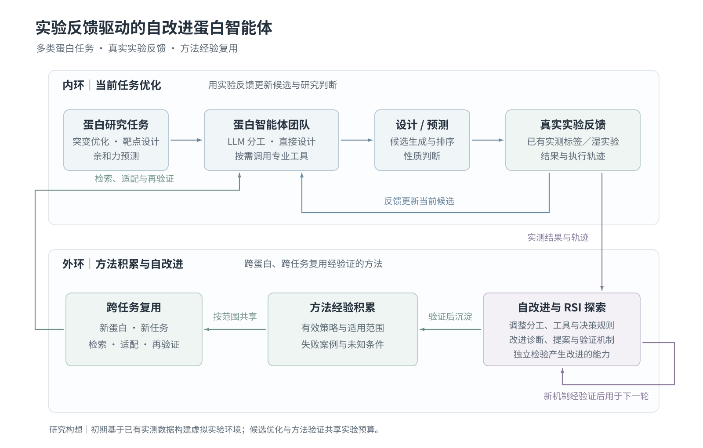

# ProteinRSI

## 方法版本治理增量

新建研究将 W/M 修改保存为独立候选，明确失败后继续稳定版，完成状态不明则阻塞等待核对。源码/配置快照、父版本、候选状态与采用/回退记录统一保存；`proteinrsi methods` 提供查看、放弃、恢复改进和历史版本回退。回退不撤销测量、已提交批次或费用，旧归档不会自动迁移。

[方法治理与命令](docs/METHOD_GOVERNANCE.md)。本增量不改变现有科学验收指标，不开放任意代码自修改，不代表已验证科学 RSI 收益。

## 类型化数据交接增量

**已有候选通过资源ID交接，不再要求LLM重新抄写整批序列。** 设计输出的突变字段使用强类型契约，格式错误有持久化、有界的修复；修复不会重新执行已经成功的模型或Python结果。

新增可选 `protocol_mode=typed`：A基于真实工具Schema生成数据流，各步骤通过类型化引用衔接，排序可以跳过设计，结构结果直接绑定下一工具，固定输入预测可以返回预测资源而非新序列。原生工具接口不能由LLM改写，蛋白工具仍按需调用；任务约束、隐藏标签和实验预算由原控制器管理。

通过新任务的 `--research-config configs/research.protocol.json` 显式启用；原 `start` 默认路径和存量配置不自动改为新协议。默认路径已获得候选交接修复。不要直接重启归档中的失败实验或修改其已发生的费用。

[实现与使用](docs/DATAFLOW.md) · [本次复用与许可](docs/DATAFLOW_REUSE.md) · [专项验证与限制](docs/DATAFLOW_VALIDATION.md)

本层是顺序数据流＋有界后缀修订，不宣称已实现任意嵌套循环、并行GPU调度或通用M协议补丁验收；其验证不等于真实模型或蛋白功能提升。下文和 `CURRENT_ISSUES.md` 保留此前版本的历史说明。

**有限实验预算下的蛋白科研团队：内环推进设计／预测，外环验证工作流修改，再对改进器本身进行独立验收。**

[English](README.en.md) · [研究执行层](docs/RESEARCH_RUNTIME.md) · [代码复用清单](docs/REUSE.md) · [本地工具](docs/LOCAL_TOOLS.md) · [ESMC-600M](docs/ESMC600M.md) · [评测](docs/EVALUATION.md) · [许可](THIRD_PARTY.md)

> **v0.5.0 是研究软件，不是已验证的自动蛋白设计产品。** 本版整合 v0.3 的本地工具与隔离环境，并新增资源选择、可修订的结构化计划和已揭示数据分析。没有 NIM 依赖，不需要启动 MCP 服务就能使用本地工具。默认演示仍是合成数值＋确定性角色；它不调用真实 LLM、蛋白模型或实验室。当前受限 RSI 修改的是提示与类型化策略，不执行任意自修改 Python。

## 整体架构与四个角色

| 角色 | 工作 | 实现 |
|---|---|---|
| A 科研负责人 | 选择相关资源、制定研究计划、根据实际结果修订未执行步骤、审核最终排序 | `agents.PrincipalAgent`＋`research/runner.py` |
| B 蛋白设计员 | 直接给出序列／编辑，或连续调用允许的设计工具 | `agents.DesignerAgent` |
| C 分析评估员 | 分析已知测量、调用计算工具、评价候选、解释新实验 | `agents.AnalystAgent`＋`research/analysis.py` |
| M 方法改进员 | 提出工作流补丁或自身策略的后继版本；不能自行验收 | `agents.MetaAgent`＋`improvement.py` |

四个逻辑角色可以共用一个对话模型。ESMC 是蛋白计算模型，不是对话 LLM。资源选择器、计划运行时、预算账本与验收器不是额外的科研 Agent。



图为用户提供的研究架构，原样保留；跨任务迁移、湿实验与 RSI 收益仍需验证，不能从图推断已完成实验。

**三个层次不可混淆**：调整当前计划是内环；修改可复用工作流 `W` 并验证是系统自改进；改进器 `M` 产生经独立验收的后继并接管后续修改，才进入本项目的受限 RSI。`evidence_version`、`workflow_version`、`meta_version` 和每次 `research run_id` 分别记录。

## v0.5：LLM 自主选方法，而不是强制工具流水线

**配置模型只是让工具可用。真实 LLM 路径中，不再自动 ESMC 打分、提取特征或 Ridge 排序。**
A/B/C 可直接依据已知证据设计和排序，也可明确请求一个或多个工具；整轮零蛋白模型调用是合法结果。
注册工具、读取配置、构造缓存标识不下载权重、不启动模型进程。
`--agent deterministic` 是另外标注的脚本基线；配置了 ESMC 的确定性基线保留自动数值排序，不能与 LLM 路线混称。
`esmc-check --download` 是操作者主动检查，不是 Agent 隐式调用。

| 本次实现 | 入口与边界 |
|---|---|
| 提示词集中、可审计 | `src/proteinrsi/prompts/*.md`；初始内容快照进任务，W/M 的策略文本另外版本化。不是直接复制他人四角色提示词 |
| 显式预测工具 | `research_fit_predict` 自选 `mutation` 或 `esmc` 特征，只使用已揭示测量。没有明确预测产物引用时不允许填造数字 |
| 更完整工具契约 | 13 个蛋白工具都带适用/不适用条件、成本提示、示例和严格结果字段；模型推理与科学效能需独立验证 |
| GB1 初始证据 | `initial_observation_policy=provided_parent`：输入已知母本序列、实测fitness和来源，不扣新查询预算；两轮可用24+24个新名额 |
| 设计与反馈分开 | 自主设计使用 `candidate_access=open`，不提供数据库候选菜单；Agent 生成序列后才查询实测反馈。排序仅使用用户明确提供的序列 |
| 缺失实测记录 | `unavailable` 携带空值，单列统计，不是零分或 QC 失败；每次提交占用一个查询名额，不提供免费数据库探测 |
| 查询预算统一 | M 评测子运行通过 `SponsoredStore` 向主任务扣费，含初始测量披露、验证、LLM、工具及配置的模型输入；不另开免费账本 |
| 正式 replay 分离 | 默认 `--execution guarded`，完整 CSV 仅在可信控制端；科研代码在新解释器经 Landlock/seccomp 限制。网络/模型经受控 RPC。系统不支持则失败，不降级 |
| 完整报告 | 最好序列与突变、逐轮最好值、唯一变体/重复查询、工具请求用途、provider token 记录、版本和验证结果。未配置价格则成本金额为空 |

**兼容性：** 新语义必须新建任务。旧任务可 `status` 检查，但继续研究会被拒绝，不能在一次实验中途偷偷改变工具规则。
只改单个 JSON 文件不会改已有任务，数据目录、权重和密钥不进入 Git。

## 用自然语言启动不同研究任务

`start` 先由 LLM 结合目标、输入文件和工具目录选择任务类型及反馈方式，不预先指定为 GB1。
支持变体设计、给定序列排序、binder 设计和固定输入的亲和力预测任务。
任务约束从本次目标／数据来源生成：固定区域、允许变长、长度范围、是否重复测量等。
排序无需人为设置母本，也无需先执行设计；de novo binder 使用真实靶标和长度范围，不造一个占位母本。

```bash
# 给定 FASTA 序列排序，允许自编指标代码，计算迭代不消耗实验查询
proteinrsi start "对输入FASTA中的蛋白序列进行计算排序，优先考虑可表达性，最多2轮；自行选择辅助工具和计算指标，说明依据，不宣称实测收益。" --input candidates.fasta --out runs/ranking

# 靶标结构可重复用 --input 传入；由 Agent 决定工具组合与评估方案
proteinrsi start "为输入PDB中的A链设计40到80残基binder，进行2轮计算迭代，比较结构与界面指标，工具可选。" --input target.pdb --out runs/binder

# 信息不足时返回问题，继续用自然语言补充，解析费用沿用同一预算
proteinrsi start "我需要计算排序，最多2轮，参考输入文件中的序列，不需要新实验。" --continue-from runs/pending
```

三种反馈方式分别处理：

- **计算研究**：根据实际工具输出／自编指标逐轮修改计划；保存候选、代码和计算指标，不产生实验观测或实验名额消耗。
- **历史实测回放**：只能选择已核验的景观和其中可查询的序列，通过控制端按预算揭示真实标签。
- **湿实验**：生成候选批次后等待批准和实测导入，不能自行编造结果继续下一轮。使用已有 `approve`、`import-results`、`step` 接口。

`research_python` 允许 LLM 编写任务相关 Python，运行后读取输出或错误、修订代码再执行。
可使用 Python 标准库和 NumPy，对当前可见证据、显式输入和已登记科学文件进行计算，也可以生成候选。
蛋白引擎仍通过各自工具调用；Python 不直接运行 shell、安装依赖或读取研究数据库。
每次执行计入工具预算，限制为10秒CPU／20秒墙钟／2GB内存；执行错误也计费并返回给 Agent 修复。
代码保存在 `programs/<hash>.py`，输入、输出、错误和版本可在轨迹中回看。
自编指标统一标为计算证据，不替代真实实验反馈。纯计算迭代暂不触发以实测收益为依据的 M 升级验收。

### GB1 回放示例

已有本地工具配置和已核验的 SSMuLA 数据时，输入研究目标即可，不需要手写 JSON：

```bash
proteinrsi start "使用GB1实测景观研究2轮，共48个新查询，每轮最多24个。母本序列和已有fitness作为初始证据，寻找实测fitness尽可能高的变体。所有蛋白工具可选，允许根据证据验证方法修改。"
```

在本机可使用 `/home/zjw/proteinrsi-tools/bin/proteinrsi`，该入口加载本地 LLM 环境配置。
`start` 使用配置的 LLM 解析目标，并由程序校验和生成任务；默认自动发现
`~/data/ssmula/` 与项目的 `configs/protein_tools.local.json`。支持 `--data-root`、
`--local-tools`、`--out` 显式覆盖。回放可选择准备状态为 `ready_strict_measured_replay` 的景观；其他任务不需要 SSMuLA 数据。
轮数需要明确；实验任务还需总查询数／每轮数量。缺少必要信息会保存澄清问题，不偷偷补预算。

母本完整序列是 `MQYKLILNGKTLKGETTTEAVDAATAEKVFKQYANDNGVDGEWTYDDATKTFTVTE`，
仅第39、40、41、54位可变。母本实测 fitness 从已核验的数据中读取并作为已有证据输入，
**不消耗新查询预算**；48次预算允许24+24个新候选，报告分开记录1条初始观测和48次查询。
GB1 原作者的 fitness 是相对野生型的实验富集分数（WT=1），不是绝对结合常数，
也不是 SSMuLA 的除以景观最大值归一化分数。

程序在可信端核验 provenance 与 CSV SHA256，导出仅含完整序列的候选目录；只把母本标签
作为初始证据交给 Agent，其他标签留在 replay 控制端。不会把整个 fitness 表交给 LLM。
启动目录自动保存 `task.json`、`library.json`、`state.sqlite3`、`report.json` 和可离线打开的 `trajectory.html`。
`start` 默认向终端滚动显示角色、工具、批次与验收事件，`--quiet` 可关闭显示。

```bash
# 另一个终端跟随运行事件；不调用 LLM 或蛋白工具
proteinrsi trace --campaign runs/YOUR_RUN --follow
# 生成可搜索和展开的离线时间线（运行中也可导出当前快照）
proteinrsi trace --campaign runs/YOUR_RUN --format html
proteinrsi trace --campaign runs/YOUR_RUN --format json --out trajectory.json
```

轨迹包括状态快照、当时已揭示的证据、工作流与 M 版本、实际 LLM 请求及返回文字、
`decision_notes`（证据、简要理由、替代方案、不确定性与下一项验证）、工具输入输出、
预算、失败和验收结果。服务若实际返回推理摘要也会保存；未返回的内部思考不会补造。
API 密钥和鉴权头不写入这些记录。HTML 仅呈现本地记录，不加载外部脚本。

LLM 默认选择工具／知识资源，然后制定、执行和修订计划；所有蛋白工具可选，实际计算由
本地工具执行。LLM调用默认上限200，工具调用默认上限100，可用 `--llm-calls` 和
`--tool-calls` 调整；目标解析的那次LLM调用也计入总量。资源选择API调用不是实验查询。

`--prepare-only` 会调用一次 LLM 解析并保存任务，但不查询新实验值、不运行科研 Agent。
正常 `start` 必须通过 guarded 隔离检查才会解析目标和执行，不会自动降级为 inprocess。
已有任务的 `init`、`replay` 等低层接口继续可用，`scripts/prepare_gb1_run.py` 接受
`--parent-fitness` 和 `--parent-source` 提供已知母本证据。
说明：[回放隔离](docs/REPLAY_SECURITY.md)、[提示词](docs/PROMPTS.md)、[工具契约](docs/TOOL_CONTRACTS.md)。

```bash
proteinrsi prompts --role designer
proteinrsi prompts --campaign runs/gb1-v05 --role analyst
proteinrsi status --campaign runs/gb1-v05
```

## 保留的 v0.4 研究执行能力

**资源选择。** 从已授权且可用的工具、当前可见数据、工作流 Skill、初始 Know-how 和当前作用域经验中选择资源。一句话入口和 `configs/research.json` 使用 `resource_selection=llm`，由预算内的 LLM 选择资源；低层 Python API 仍保留 `rules` 确定性选项。选择不扩大权限，不读取隐藏标签，不安装新工具。文档和工具描述都是参考数据，不是更高权限的指令。

**结构化计划。** A 可以安排“先分析→再设计”，也可在分析后再次设计。计划包含假设、步骤、依赖、问题和预期产物；执行器记录实际负责人、完成状态、输出引用及修订历史。只能修改未执行部分；最终提交必须经过设计、最新候选池的 C 排序和 A 审核。每个完成步骤持久化。已失败／状态不确定的执行明确阻塞，不静默改用假结果。

**只读实验分析。** 增加 `research_evidence_summary`、`research_prediction_errors`、`research_combination_effects` 三个上下文绑定工具。它们不能接收隐藏标签、任意文件路径或自报实验值，只访问当前 `TaskView`。误差分析使用当初送测时冻结的预测；组合效应需显式选择 linear/log 标度，默认不跨实验批次混合，缺母本或组成单突变实测就报告缺失。这些是描述性分析，不自动校正测量，也不是显著性证明。

**知识与经验分离。** Know-how 是初始方法说明，Skill 是操作方法，Method Experience 是有验证记录及适用范围的方法修改。Know-how 在任务初始化时保存内容快照。当前经验主要在任务内记录／检索；跨蛋白传递和收益仍需专门协议，不宣称已解决。

## 实际复用与借鉴：不是把多个仓库直接嵌套

| 来源 | 类型 | 具体复用／借鉴 | 本项目位置及边界 |
|---|---|---|---|
| **Biomni** | **有限的源码改编＋架构借鉴** | 改编 `ToolRetriever` 的分类检索与资源格式化；借鉴计划—执行—观察和 Know-how 思路 | `research/biomni_retriever.py` 为 **Apache-2.0**；它在 `resource_selection=llm` 路线被调用。预算化 JSON 客户端、索引校验和权限预过滤是本项目修改。没有引入 A1 主类、全局 REPL、全部工具或 E1 环境 |
| **ProteinMCP** | 架构借鉴，**未复制源码** | 一模型一环境、工具注册、Skill 组织 | `localtools/` 是原创函数／描述／Worker；不依赖 Claude Code 或其 MCP 服务管理器 |
| **LangGraph** | 可选库/API 复用 | StateGraph、SQLite 检查点、批准／结果中断恢复 | `integrations/langgraph.py`；复用同一个 `Campaign`，不是第二套实验循环 |
| **GEPA** | 可选库/API 复用 | `evaluate`、反思数据接口与优化入口 | `integrations/gepa.py`；需要操作者提供受控 evaluator 和反思模型，候选必须另过 gate；未自动取代 M |
| **Virtual Lab** | 可选库/API 复用＋角色思路借鉴 | 调用上游 `Agent` / `run_meeting`，参考 PI／专家分工 | `integrations/virtual_lab.py` 是显式可选讨论，不是默认 A/B/C 的隐藏依赖 |
| **Transformers / ESMC** | 实际模型/API 复用 | 原生 ESMC-600M 加载、掩码打分和特征 | `protein/esmc.py`；权重另行下载并固定版本，模型不是本项目训练 |
| **ProteinMPNN / RFdiffusion / Protenix / PyRosetta** | 部署后调用上游原生程序/API | 逆折叠、骨架生成、结构预测、可选物理分析 | `localtools/functions.py`＋`worker.py`；不重写模型，安装、许可与权重另行准备，新增引擎尚未端到端实测 |
| **ProteinSwarm** | 架构参考，**未复制源码** | LLM 直接序列编辑与反馈的思路 | 不宣称复现其实验、残基群体或设计收益 |
| **HyperAgents / ADAS** | 架构参考，**未复制源码** | 后继改进器／工作流搜索 | 本项目是原创的受限策略演化，未包含 HyperAgents 非商业源码 |
| **ALDE / SSMuLA / EVOLVEpro** | 方法／评测参考，**不是代码依赖** | 实测反馈、主动学习和蛋白特征＋轻量预测器的分工 | 自带 Ridge 是原创 NumPy 基线，不是 ALDE/EVOLVEpro；真实数据由用户依法提供 |

Biomni 源码审读版本固定为 [`400c1f3`](https://github.com/snap-stanford/Biomni/tree/400c1f366b96a35ca253e13c9b06c5076af41d65)。源文件、修改内容、许可和验证边界见 [REUSE](docs/REUSE.md)。不复制论文性能数字，不声称当前仓库等同于 Biomni 正刊使用的确切代码版本；也不将它的单次运行 `self_critic` 称为本项目的 RSI。

## 安装与离线演示

Python 3.11+，Linux/macOS，Windows 使用 WSL。代码包不包含模型权重、实验数据和密钥。

```bash
cd ProteinRSI
python -m venv .venv
source .venv/bin/activate
pip install -e '.[dev]'

# 新增研究运行时，角色与数据仍明确为脚本/合成
proteinrsi demo --adaptive --out runs/research-demo --rounds 3
proteinrsi research plans --campaign runs/research-demo/campaign
proteinrsi research resources --campaign runs/research-demo/campaign
proteinrsi research analyze --campaign runs/research-demo/campaign
pytest -q
```

不带 `--adaptive` 的 `demo` 保留原固定流程，可做工程对照；不能把两条脚本流程的演示差异当作 LLM 协作收益。输出含 SQLite、批次与结果模板、资源快照、研究计划、逐步输出和 `report.json`。不会强制让补丁被采纳；结果可以是 `inconclusive`。

## 配置入口

| 文件 | 作用 |
|---|---|
| `.env.example` | A/B/C/M 对话 LLM 的模型、BASE_URL 和密钥模板 |
| **`configs/research.json`** | 资源选择模式、上下文额度、计划步数、修订次数和执行上限 |
| **`configs/protein_tools.json`** | 本地重型模型环境、资产、版本与执行限额；新增引擎默认禁用 |
| `examples/esmc600m.json` | 单独使用 ESMC 时的设备、精度、批量和输入限额 |
| `examples/wetlab_task.json` | 母本、允许位点、任务目标、测量协议与预算 |
| `examples/workflow.json` / `workflow.binder.json` | W 的提示、策略、工具及 Skill 白名单 |
| `examples/meta_policy.json` | M 的初始受限策略 |

`init` 保存配置；修改样例文件不会热更新既有任务。**新 CLI 任务默认 adaptive＋ESMC可用（不强制调用）；未传 research_config 的 Python API 保持固定路径。v0.5 拒绝继续旧版本创建的任务，请保留旧程序或新建任务，避免悄悄改变实验语义。** 用 `--research-mode fixed` 创建固定流程基线；用 `--protein-model none` 创建不加载蛋白模型的基线。协议和权限不能由 M 修改。

```bash
# 首先根据机器安装相应 CPU/CUDA PyTorch，再安装 ESMC 依赖
pip install -e '.[esmc]'
# 将任务样例改成自己的序列、位点、指标与已审核实验协议
proteinrsi init --task examples/wetlab_task.json --out runs/protein \
  --protein-config examples/esmc600m.json --research-config configs/research.json
proteinrsi esmc-check --campaign runs/protein --download

# 编辑 .env 后手工加载；程序不会自动 source 文件
set -a; source .env; set +a
proteinrsi step --campaign runs/protein --agent llm
```

`PROTEINRSI_MODEL` 填对话模型，**不要填 ESMC**。客户端支持 Chat Completions 与 Responses JSON 接口，用 `PROTEINRSI_API_PROTOCOL` 选择（默认 `chat_completions`）；`PROTEINRSI_REASONING_EFFORT=medium` 设置推理强度。配置 `PROTEINRSI_CODEX_AUTH_FILE` 可读取本机 Codex `auth.json` 的 `OPENAI_API_KEY`，无需复制密钥到 `.env`。第三方 HTTP 地址需要显式设置 `PROTEINRSI_ALLOW_HTTP=true`。LLM 出错明确失败。开启 `resource_selection=llm` 会消耗同一个 `llm_calls` 预算，显式 `rules` 基线不额外调用检索 LLM。

## 蛋白工具与独立环境

本版保留 **13 个蛋白／结构／MSA 工具**、**3 个任务上下文分析工具**，再提供显式 `research_fit_predict` 与 `library_check/sample`。ESMC、ProteinMPNN、RFdiffusion、Protenix 与可选 PyRosetta 各司其职，所有任务不必运行全部模型。

```text
Agent → 类型化工具函数 / 独立描述 → 白名单、预算、产物校验
      → 模型独立 Python 环境或可选容器 → 上游原生程序 → 结构化结果
```

```bash
proteinrsi tools list --config configs/protein_tools.json
proteinrsi tools describe --name proteinmpnn_design
python scripts/setup_local_tools.py --engine proteinmpnn --prefix /opt/proteinrsi
# 先阅读计划，确认后才加 --execute。环境/权重/许可完成后生成 tools.local.json。
proteinrsi tools doctor --config tools.local.json --probe --strict
proteinrsi init --task examples/wetlab_task.json --out runs/isolated \
  --local-tools tools.local.json --research-config configs/research.json
```

`tools list` 列的是模型工具部署目录；上下文分析／预测／目录工具在运行时绑定当前可见数据。ESMC 也可使用 `configs/esmc600m.isolated.json` 指定独立解释器。MCP 仍为兼容已有外部工具的可选通道，但本地路线不需要它。**独立环境隔离依赖，不等于操作系统安全沙箱。** 本版不开放任意 `exec()`／模型生成 shell。

## 多轮实测反馈与双闭环

```bash
proteinrsi step --campaign runs/protein --agent llm
# 人工检查批次、序列和预算
proteinrsi approve --campaign runs/protein --batch YOUR_BATCH_ID --operator YOUR_NAME
# 实验室完成测量，保留模板样本身份、单位、来源和协议
proteinrsi import-results --campaign runs/protein --file /path/to/results.csv --agent llm
proteinrsi step --campaign runs/protein --agent llm
```

只有新实测导入后才开始下一轮实验反馈；一次湿实验前的多步计算不是多轮湿实验。批准／提交名额计费，不能通过回滚 W 退款。导入一个批次的所有最终状态，失败／无结论不是零；相同结果重复导入不重复计费。人工 CSV 只是集成接口，软件不能自行证明其真实性。

历史数据使用 `scripts/prepare_replay.py` 准备，再运行 `proteinrsi replay --dataset ...`。源数据不附带。隐藏标签只由受控揭示器读取，**资源检索与分析工具没有“免费查真实标签”的通道**；查询式回放仍不是新湿实验。

工作流补丁先经类型、权限和可用性检查，再在后续相同名额双臂试用。
**新建研究默认自动验证 M 的自身策略补丁**：下一批次中，旧 M 与新 M 获得相同的已知证据、
起始工作流和对称计算上限，各提出一个后继工作流，再提交互不重复、数量相等的候选。
查询占用当前批次与主研究总预算，工具和 LLM 也由主账本计费；没有额外免费验证轮次。
固定 gate 根据实测结果验收，通过才切换 M；后继工作流不会随 M 一并未经独立验证就替换当前 W。
方案相同、验证失败或证据无结论均不升级，名额不足则记录延期。M 不必每轮提出修改。
验证分支各有独立存储，复制相同的工具配置与已登记科学文件，并沿用 guarded worker。
这是**当前任务的探索性比较**，不证明跨蛋白泛化，也不构成多次自适应选择后的确认性统计结论。
旧研究缺少自动验证配置时保持原语义；`Campaign.initialize(..., auto_meta_evaluation=False)` 可关闭新行为。

独立跨案例评估接口 `proteinrsi evaluate-meta --cases ... --promote` 继续保留；
该接口的初始标签披露计费、分组独立性和最终测试不得选版本的约束不变。
它仍不支持通用外部结构引擎案例；正常研究中新接入的任务内验证不走这个接口，
因此不会仅因配置了本地结构引擎而被拒绝。正式跨任务评估需要另行准备独立案例和评价器。

## 当前没有完成的能力

当前服务器已通过实际 Landlock/seccomp worker 和双分支验证测试；其他主机仍需先运行 `sandbox-check`。没有新增重型引擎的真实端到端／GPU 验证，没有付费 LLM 端到端运行，没有新湿实验或 RSI 科学收益证明。定量蛋白—蛋白亲和力、完整全原子质量验证、跨蛋白持续经验迁移和单 Agent／多 Agent 科学对照仍需专项工作。历史 ESMC CPU 推理记录不能替代本版新功能验证。除已有确定性分析算子外，新增独立进程中的生成代码工具；其科学有效性仍需按具体任务验证。

## 许可与测试

原创核心代码、测试与文档继续采用 **MIT**。`research/biomni_retriever.py` 的改编部分采用 **Apache-2.0**，完整原许可在 `licenses/Biomni-Apache-2.0.txt`，出处和修改记录在 `NOTICE`。分发包元数据写作 **`MIT AND Apache-2.0`**，表示并存文件义务，**不是任选其一的双许可**。其他依赖、权重、数据库、PyRosetta 分别遵守其条款；未重新许可它们。

```bash
pytest -q --cov=proteinrsi --cov-report=term-missing
python -m compileall -q src
python -m build
```

实际执行结果与未运行项见 [TESTING](docs/TESTING.md)；版本变化见 [CHANGELOG](CHANGELOG.md)。本次发行内容不包括用户研究 PDF、私有实验数据、密钥或模型权重。

### 协议启动（2026-10-06）

新建自然语言研究 `proteinrsi start "目标与初始输入"` 默认由 LLM 生成类型化研究协议。
工具接口从实际注册表读取，结果通过资源 ID 交接，格式和映射错误有界修复。
整板任务加 `--full-plate`；兼容旧规划方式可加 `--protocol-mode legacy`。
已有研究保持其保存的配置，不自动恢复或迁移。参见 [数据流与协议](docs/DATAFLOW.md)。
