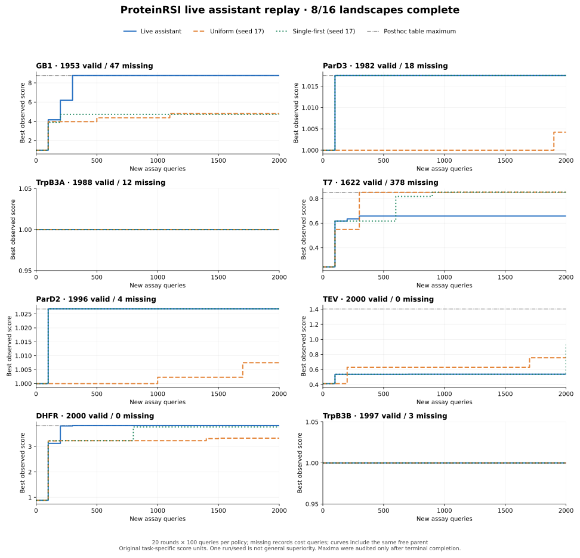

# Live assistant replay: full-budget suite (partial, 8/16 complete)

8 independent landscapes have completed **20 rounds × 100 new queries** with real assistant role decisions, trusted tool execution, returned historical measurements, analysis, budgeted method comparisons and durable restarts. Total live queries: **16,000**, including **15,538 valid** and **462 unavailable**, with **zero repeated queries**. The remaining 8 landscapes are running or queued. This is historical assay replay, not new wet-lab measurements; this partial selection is not the full suite result.

## Equal-query results

Each live study and each separate comparator used 2,000 new query slots. Missing records consumed slots, without free membership tests or resampling. All policies received the same free parent observation. Scores below include that parent. Original score units differ between landscapes and must not be pooled.

| Landscape | Parent | Live best | Uniform, seed 17 | Single-first, seed 17 | Posthoc table maximum | Live valid / missing |
|---|---:|---:|---:|---:|---:|---:|
| GB1 | 1 | 8.761965656 | 4.802041538 | 4.721708359 | 8.761965656 | 1953 / 47 |
| ParD3 | 1 | 1.017502225 | 1.004218588 | 1.017502225 | 1.017502225 | 1982 / 18 |
| TrpB3A | 1 | 1 | 1 | 1 | 1 | 1988 / 12 |
| T7 | 0.24515374 | 0.65786237 | 0.8512114 | 0.8512114 | 0.8512114 | 1622 / 378 |
| ParD2 | 1 | 1.026803807 | 1.007499348 | 1.026803807 | 1.026803807 | 1996 / 4 |
| TEV | 0.414362 | 0.5385917 | 0.75625825 | 0.9316145 | 1.4044468 | 2000 / 0 |
| DHFR | 0.8848583981 | 3.825167326 | 3.3416499 | 3.769913187 | 3.825167326 | 2000 / 0 |
| TrpB3B | 1 | 1 | 1 | 1 | 1 | 1997 / 3 |

At this checkpoint, live search beats both controls on GB1 and DHFR; it ties the better control on ParD2, ParD3, TrpB3A and TrpB3B; it loses on T7 and TEV. The live best improved beyond the parent on six of eight tasks. Terminal-only audits show no above-parent record exists in the supplied TrpB3A/B tables. Those audits were **not** available to the researchers, and all studies completed their full budgets.

GB1 reached its table maximum in round 3 (V39F/D40W/G41A/V54A). DHFR reached its aggregate table maximum in round 3 (A26K/D27E/L28M). ParD2 and ParD3 reached their maxima in round 1, matching the single-first control. T7 and TEV demonstrate an important limit: successful operation and improvement over the parent do not imply superiority to a simple search control.

One trajectory per policy and one comparator seed do **not** establish general superiority, repeated-run reliability, or scientific RSI efficacy. The benchmark also cannot exclude prior knowledge of famous public landscapes in model pretraining. No unrevealed lookup labels were intentionally supplied to researchers. Maximum values are evaluation-only scalar bounds after termination; no unqueried genotype identities are exported.

## What actually ran

- Pinned scientific engine: [`ff678883c496610458d179807b0a54443fd940fd`](https://github.com/zzjw0611/ProteinRSI/tree/ff678883c496610458d179807b0a54443fd940fd). Later presentation/preflight fixes do not alter active engine snapshots. All 112 pinned source files were independently compared to the commit.
- Fresh assistant context and separate mailbox per landscape, including overlapping TrpB panels. Each role response followed an actual request and available feedback. No scripted/mock responder substituted for the live assistant. Its model label is operator provenance, not authenticated native-provider identity.
- Live committed calls: **1,015 LLM calls and 31 tools** across these 8 tasks, including copied intake budget debits. No paid external model API was used. Provider token and monetary cost figures are unavailable, not invented as zero.
- Every terminal study has 20 full plates, 2,000 distinct new identities, and no outstanding reservations. Exact terminal replay added no measurements, requests or charges. The operator independently compared saved before/after snapshots; [restart audit](restart-audit.json) provides canonical hashes and checked fields.
- Across these eight studies, eight W comparisons produced one accepted local pairwise workflow (TrpB3B), two rejections and five inconclusive outcomes. Three nested M comparisons were rejected. Changing panels means these are workflow-level outcomes, not isolated causal effects of a model feature. No transfer validation or broad method improvement is claimed.
- Comparator orders were frozen before oracle access. Their 4,000 additional queries per landscape are separate evaluation studies, not free training labels. The initial eight comparator terminal reruns were also checked to retain identical logical records, charges and report bytes.

## Prospective prediction denominators

| Landscape | Frozen numeric predictions | Valid observations with predictions | Valid observations without predictions |
|---|---:|---:|---:|
| GB1 | 250 | 249 | 1704 |
| ParD3 | 200 | 199 | 1783 |
| TrpB3A | 100 | 100 | 1888 |
| T7 | 250 | 197 | 1425 |
| ParD2 | 300 | 300 | 1696 |
| TEV | 400 | 400 | 1600 |
| DHFR | 250 | 250 | 1750 |
| TrpB3B | 350 | 350 | 1647 |

Null estimates are not zeros, and a fit call alone does not freeze estimates. A trusted artifact must flow through C ranking and final selection. GB1 round 3 used a B-only final response and legitimately had no frozen estimates despite a fit call; subsequent rounds used the supported typed path. No estimates were backfilled. The [round audits](round-audits/) list every actual pipeline, tool event, prediction-error denominator and method-validation plate. Error metrics describe the selected queried slices, not out-of-sample generalization.

## Data provenance and special adapters

Source: [official SSMuLA release 15203754](https://zenodo.org/records/15203754), with pinned input hashes in the preparation manifest. No global maximum normalization or fitness-based filtering was applied. GB1 uses reported enrichment relative to WT; ParD/TrpB use original reported fitness; T7 and TEV use original reported fitness mean.

TEV uses the primary FLIGHTED 233-aa measured construct and actual sites 143/145/164/167, with the source table matched byte-for-byte to that repository. DHFR is explicitly a **canonical-reference reconstructed aggregate benchmark**: mean(exp(original codon score)) over observed synonymous non-stop codons per amino-acid tuple, 226,175 codon records to 8,000 tuples, and a 159-aa canonical P0ABQ4 representation at sites 26/27/28. The parent averages 42 synonymous records. It is not a claim that this full sequence is the literal measured construct or that structural engines were validated. Neither adapter silently substitutes max-normalized scores.

## Engineering acceptance and remaining limits

The user approved **trusted inprocess debugging** because this cloud kernel lacks the required Landlock primitive. The guarded default remains fail-closed. Separately, [latest supported Ubuntu CI](https://github.com/zzjw0611/ProteinRSI/actions/runs/37456140247) reports Landlock ABI 7 and libseccomp: 599 tests passed, with only two ESMC-related skips in its Python 3.12 job. Thus guarded automated tests, including native-input pause/recovery, ran on a supported host. All live studies here still use inprocess execution, and operational label separation is not OS isolation.

The long-run report bloat was repaired separately: bounded pages, streamed full JSON, and exact compressed/deduplicated evidence. T7's 956,786,075-byte legacy HTML becomes an 11,618,188-byte complete bundle, a 2,549-byte overview, and pages no larger than 334,117 bytes. Identical re-export adds zero bytes; originals remain preserved. [Format and validation](../../docs/TRACE_EXPORTS.md) document exact source-cell reconstruction. Browser interaction remained blocked by host/browser restrictions, so visual/runtime behavior is not claimed from static tests.

Native HTTP now has an explicit 256 KiB default request-body preflight, configurable by the operator. Oversize requests pause before networking or paid-call charges with complete immutable audit and stable resume identity. [Input contract and recovery](../../docs/LLM_CONTEXT.md) explain why this is a byte budget, **not token-window verification** or automatic context compression. Actual completed requests reached 4.05 MB. The unchanged 4,096-token output allowance may not fit 100 complex candidate records. No native API, full native 100-well loop, untrusted generated Python, heavy undeployed protein model, or wet-lab infrastructure was validated. There is no zero-bug or guaranteed scientific-gain claim.

## Inspectable records

- [Summary with exact scalar values, queried winners and W/M outcomes](summary.json)
- [All 480 policy-by-round best-so-far records](best-so-far.csv) and [vector chart](best-so-far.svg)
- [Per-round pipelines and prediction denominators](round-audits/)
- [Terminal restart snapshot comparisons](restart-audit.json)
- [Hashes of preserved source databases and reports](source-evidence-manifest.json)
- [Earlier independent smoke results](../2026-10-06-live-assistant/README.md)

Source tables, full assistant messages and unqueried genotype identities are absent from this curated publication. Relative artifact names in manifests identify preserved local evidence, not downloadable files. This report will expand only as the remaining independent studies finish.
